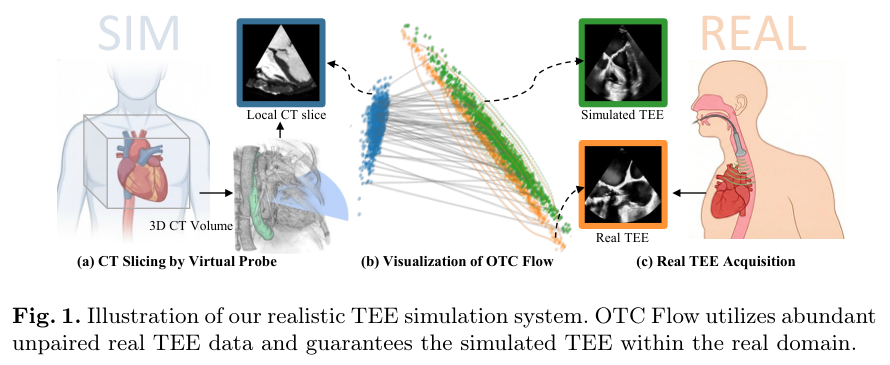
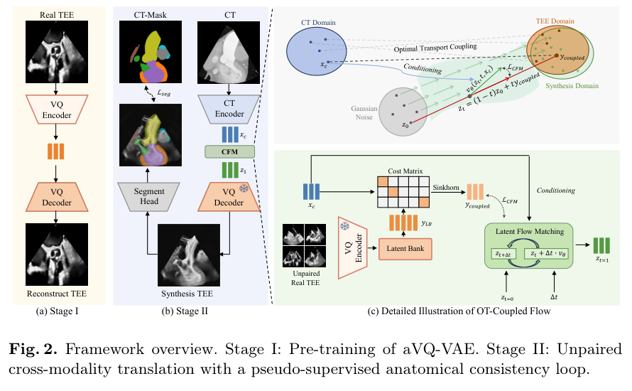
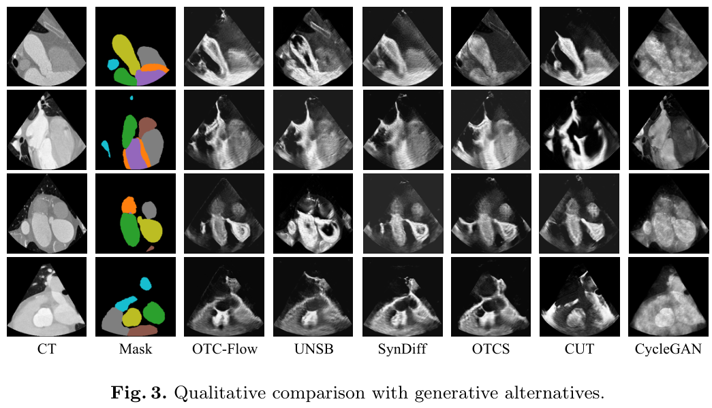
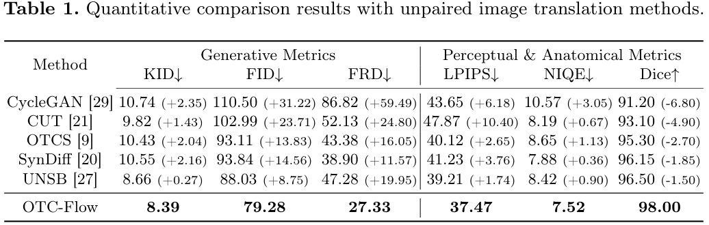

# [MICCAI26] OT-Coupled Flow: Towards Realistic TEE Simulation via Unpaired Cross-Modality Translation with Anatomical Consistency
[](https://huggingface.co/lealaxy/OTC-Flow)
[](LICENSE)

**Yunhao Li<sup>1</sup>, Yidan Feng<sup>1</sup><sup>⋆</sup>, Ho-On Alston Conrad Chiu<sup>2</sup>, Simon Cheung-Chi Lam<sup>2</sup>, Yan Pang<sup>3</sup>, Qiong Wang<sup>3</sup>, Chun-Ka Wong<sup>2</sup>, Jing Qin<sup>1,4,5</sup>**

<sup>1</sup> The Center for Smart Health, School of Nursing, The Hong Kong Polytechnic University, Hong Kong, China  
<sup>2</sup> Queen Mary Hospital, LKS Faculty of Medicine, The University of Hong Kong, Hong Kong, China  
<sup>3</sup> Shenzhen Institute of Advanced Technology, Chinese Academy of Sciences, Shenzhen, China  
<sup>4</sup> CAS SIAT-PolyU Multi-modal Medical Molecular Imaging Joint Laboratory, The Hong Kong Polytechnic University, Hong Kong, China  
<sup>5</sup> PolyU-Qianhai Technology and Innovation Research Centre, The Hong Kong Polytechnic University, Hong Kong, China

<sup>⋆</sup> Corresponding author


This repository contains the public implementation accompanying the published
manuscript. OTC-Flow synthesizes transesophageal echocardiography (TEE)-like images
from CT-derived conditions without requiring a pixel-aligned CT/TEE target. The
release follows the published OTC-Flow checkpoint: a MONAI SegResNet CT encoder,
a CNN latent velocity field, and a control-variate OT queue of 4096 real-TEE
latents.

## Overview

CT and TEE observe anatomy through different acquisition processes. A paired pixel
loss therefore encourages the model to reproduce an arbitrary appearance instead of
learning a plausible TEE observation. OTC-Flow separates the problem into two
parts: a real-TEE latent prior supplies target-domain appearance, while optimal
transport coupling and anatomical consistency connect that prior to CT geometry.



## Method

The method is trained in two stages:

1. An adversarial VQ-VAE learns a compact latent space from real TEE frames.
2. With the VQ-VAE frozen, a CT encoder predicts a latent velocity
   field. Optimal transport couples CT-conditioned features with real-TEE latents,
   and the training objective combines conditional flow matching, anatomical
   consistency, latent cycle alignment, radial power-spectrum statistics, and a
   lightweight multi-scale discriminator.

The target image is generated by integrating the learned latent flow and decoding
with the frozen TEE VQ-VAE. Real TEE is used during training only; inference takes
the CT tensor and the condition tensor required by the public model API.



## Data

The repository does not redistribute medical data. Prepare data under the terms of
the original dataset or institutional agreement. The public loader uses JSONL
manifests with paths relative to each manifest directory.

VQ-VAE manifest:

```json
{"image": "tee/frame_000001.pt"}
```

OTC-Flow manifest:

```json
{"ct": "ct/sample_000001.pt", "tee": "tee/frame_000001.pt", "conditions": "conditions/sample_000001.pt", "labels": "labels/sample_000001.pt"}
```

The default tensor contracts are CT `[C,H,W]`, TEE `[1,H,W]`, conditions
`[condition_dim]`, and integer anatomical labels `[H,W]`.

## Installation

```bash
git clone https://github.com/lealaxy/OTC-Flow.git
cd OTC-Flow
uv sync
```

The package requires Python 3.11 or newer. Install a CUDA-enabled PyTorch build
appropriate for the target machine before training.

## Training

Stage 1 trains and exports the real-TEE VQ-VAE:

```bash
uv run otc-flow-train-vqvae \
  --image_manifest /path/to/tee_frames.jsonl \
  --output_dir /path/to/vqvae_checkpoint \
  --batch_size 32 \
  --epochs 20
```

Stage 2 freezes that VQ-VAE and trains OTC-Flow:

```bash
uv run otc-flow-train \
  --manifest /path/to/ct_tee_pairs.jsonl \
  --vqvae_source /path/to/vqvae_checkpoint \
  --output_dir /path/to/otc_flow_checkpoint \
  --batch_size 32 \
  --epochs 20
```

The public conversion script accepts either a Lightning checkpoint or the
published safetensors checkpoint. For the latter, provide the matching VQ-VAE
configuration directory; the exported model embeds that configuration and does
not require the source experiment directory at inference time:

```bash
uv run otc-flow-convert-checkpoint \
  --checkpoint /path/to/otc_flow_best/model.safetensors \
  --vqvae_source /path/to/tee_vqvae \
  --output_dir /path/to/otc_flow_checkpoint
```

Both training entry points use PyTorch Lightning. Command-line arguments are parsed
with `transformers.HfArgumentParser`; Lightning handles device placement,
checkpointing, and distributed training.

## Evaluation and inference

The published manuscript reports the following test results for OTC-Flow. These
values are reproduced from the manuscript and are not silently recomputed by the
release scripts.

| KID | FID | FRD | LPIPS | NIQE | Dice |
| ---: | ---: | ---: | ---: | ---: | ---: |
| 8.39 | 79.28 | 27.33 | 37.47 | 7.52 | 98.00 |

The trained weights are intended to be distributed through
[`lealaxy/OTC-Flow`](https://huggingface.co/lealaxy/OTC-Flow). The source release
does not contain a `checkpoints/` directory.

### Model card

The Hugging Face repository contains the converted OTC-Flow weights and config:

| File | Description |
| --- | --- |
| `model.safetensors` | OTC-Flow model weights, including the frozen TEE VQ-VAE |
| `config.json` | Self-contained Hugging Face model configuration |

The model is intended for research use on CT-derived TEE simulation. It does not
produce a clinically acquired TEE frame, and generated images should not be used
for diagnosis or treatment decisions. The release does not include medical data;
users must prepare inputs according to the tensor contracts below and comply with
the licenses and governance requirements of their data sources.

```bash
hf download lealaxy/OTC-Flow --local-dir /path/to/otc_flow_checkpoint
uv run otc-flow-infer \
  --checkpoint /path/to/otc_flow_checkpoint \
  --ct /path/to/ct/sample_000001.pt \
  --conditions /path/to/conditions/sample_000001.pt \
  --output /path/to/generated_000001.pt
```

The inference script writes a CPU PyTorch tensor. The Python API is:

```python
from otc_flow import OTCFlowModel

model = OTCFlowModel.from_pretrained("/path/to/otc_flow_checkpoint").eval()
generated = model.generate(ct_pixel_values, conditions)
```

## Results



The qualitative comparison shows CT, its anatomical mask, and outputs from OTC-Flow
and representative unpaired translation methods.



The ablation table from the manuscript is also available as
[`docs/figures/ablation_results.png`](docs/figures/ablation_results.png).

## Repository layout

```text
configs/                  Example stage configurations
scripts/                  Training, conversion, validation, and inference entry points
src/otc_flow/             Self-contained model, VQ-VAE, data, and Lightning modules
docs/                     Extracted paper figures
```

## Citation

```bibtex
@inproceedings{li2026otcflow,
  title={OT-Coupled Flow: Towards Realistic TEE Simulation via Unpaired Cross-Modality Translation with Anatomical Consistency},
  author={Li, Yunhao and Feng, Yidan and Chiu, Ho-On Alston Conrad and Lam, Simon Cheung-Chi and Pang, Yan and Wang, Qiong and Wong, Chun-Ka and Qin, Jing},
  year={2026}
}
```

## License

The source code is released under the MIT License. Third-party dependencies and all
medical datasets remain subject to their respective licenses.
